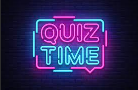
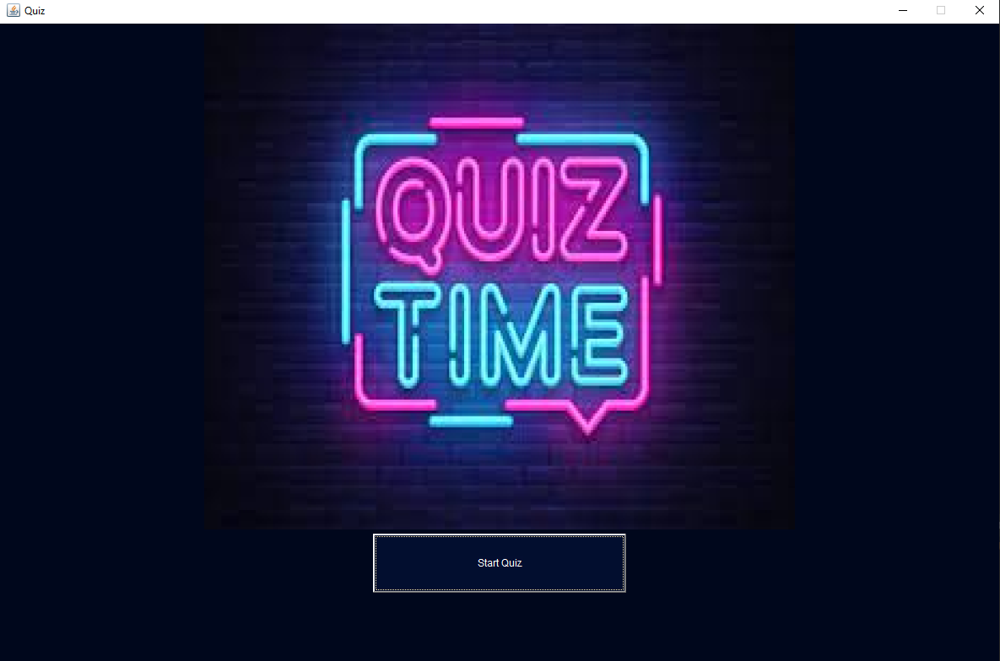
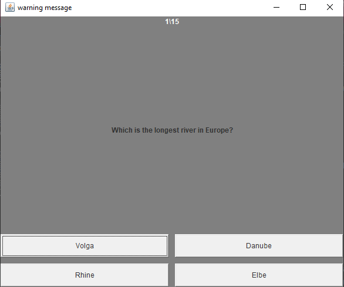
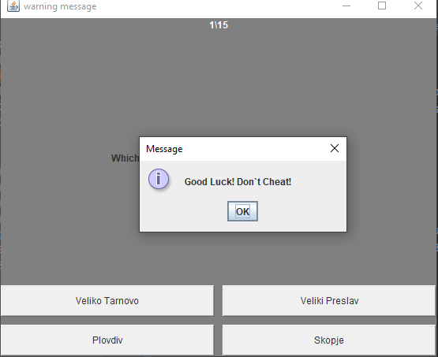
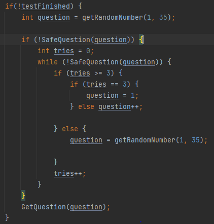
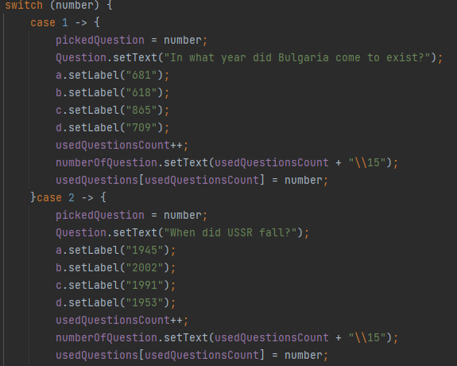
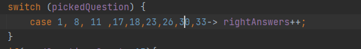
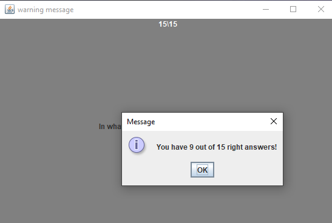

# Quiz App

A Quiz made in Java with GUI.It contains history questions with 4 possible answers.It`s like that ,because I love history.
You have 15 questions, and after you make your answers ,you get the number of the right ones.
You don't have to look in the Internet ,if the right answers of the question are accurate.
Just believe me,I know they are :) :) .After you finish the quiz
you don't see your wrong answers.

## 
 Quiz class
The Quiz(Main) class which just makes a new 
QuizFrame object.

## 
 QuizFrame

Here we make the starting frame,which just contains a starting
picture and a "Start Quiz" button which makes new QuizPanel,that 
contains the Quiz.If you click the "Start" button when the quiz is 
already started,the quiz is just restarted ,with the previous result
completely forgotten.

## 
 QuizPanel

The QuizPanel class contains the quiz with question made as
a JLabel and 4 possible answers made like a Buttons.There
is also a counter for the answered questions out of 15 possible.

#### 
Start Window

When you start the quiz actually you get a MessageDialog that 
contains a really important message to the one playing the quiz.

The question you get is, of course, randomised for better replayability.
In the "getRandomNumber" function you get random number from 1
to 35(currently the number of possible questions).When a question
is used ,it its index is saved in an array, so it cannot be repeated more
than once.That`s what the function "SafeQuestion" does,It looks if the index
of the question exists in the array.If it does, we get an index of a new question
, until it is not used.

In "GetQuestion" function I use a switch to get the labels of the question and possible answers.
And the question is added to the array of used questions and the index of the question is saved.

When you click a button that you think contains the 
right answer ,there is a switch that includes the indexes of the questions that have this button as a right answer.
If the index is there you get a point for a right answer

Then ,if the question is not last(the 15th) you get a new question.
The quiz is made in such a way,that the buttons have equal amount of right
answers.

After you answer to 15 questions you get a message that tells you how
many are right.You don't know where your mistakes are, and that is made on
purpose.This is made to see your knowledge,not to learn,although I could 
make a friendlier version in the future. 

After you click "OK" on the message
,the frame with the quiz is closed and you cant start the quiz again, how many
times you want.

